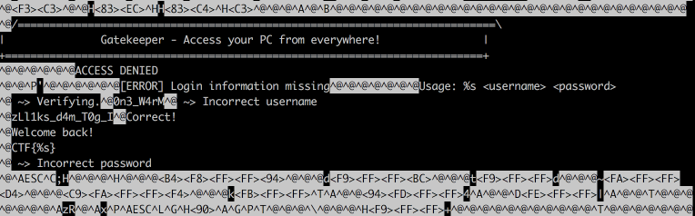

### Gatekeeper / RE / WebPluxMediaPC

Flag: `CTF{I_g0T_m4d_sk1lLz}`

> It's a media PC! All fully purchased through the online subscription revolution empire "GimmeDa$". The PC has a remote control service running that looks like it'll cause all kinds of problems or that was written by someone who watched too many 1990s movies. You download the binary from the vendor and begin reversing it. Nothing is the right way around.

`attachment`

The ZIP contains a binary:

```
$ ./gatekeeper
/===========================================================================\
|               Gatekeeper - Access your PC from everywhere!                |
+===========================================================================+
[ERROR] Login information missing
Usage: ./gatekeeper <username> <password>
```

Let's try some things:

```
$ ./gatekeeper  foo bar
/===========================================================================\
|               Gatekeeper - Access your PC from everywhere!                |
+===========================================================================+
 ~> Verifying....
ACCESS DENIED
 ~> Incorrect username
```

Interesting! See the `incorrect username` error? This nice application tells us when we hit a correct username. Usually secure applications don't leak any information. They will say `incorrect credentials` or 'incorrect username or password'.

Anyways, let's look at the binary:


I see some leet-speak strings here! `0n3_W4rM` and `zLl1ks_d4m_T0g_I` and our friendly `CTF{%s}` pattern.

Let's try our found strings:

```
$ ./gatekeeper 0n3_W4rM x
/===========================================================================\
|               Gatekeeper - Access your PC from everywhere!                |
+===========================================================================+
 ~> Verifying.......ACCESS DENIED
 ~> Incorrect password
```

Nice! We hit the correct username, because the application now errors on `incorrect password`.

Using `zLl1ks_d4m_T0g_I` is a dud. Remember the text from the intro?

> Nothing is the right way around.

Take a second look at `zLl1ks_d4m_T0g_I` now?

Yes its try again with this string reversed:

```
$ ./gatekeeper 0n3_W4rM I_g0T_m4d_sk1lLz
/===========================================================================\
|               Gatekeeper - Access your PC from everywhere!                |
+===========================================================================+
 ~> Verifying.......Correct!
Welcome back!
CTF{I_g0T_m4d_sk1lLz}
```

Done!
