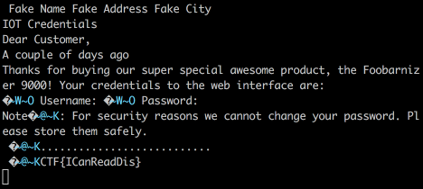

### Letter / MISC / Garbo-Can

Flag: `CTF{ICanReadDis}`

> You really went dumpster diving? Amazing. After many hours, SUCCESS! Between what looks like a three week old casserole and a copy of "Relative-Time Magazine", you found this important looking letter about the victims PC. However the credentials aren't readable - can you still obtain them?

`attachment`

The attached ZIP contains a PDF. Open it and see blacked out credentials:

Let's check for any hidden text by copying all text from the PDF to a text editor:

And the flag is visible.
