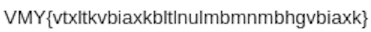

### OCR is cool! / MISC / Foobanizer9000

Flag: `CTF{caesarcipherisasubstitutioncipher}`

> Caesar once said, don't stab me… but taking a screenshot of an image sure feels like being stabbed. You connected to a VNC server on the Foobanizer 9000, it was view only. This screenshot is all that was present but it's gibberish. Can you recover the original text?

`attachment`

The attached ZIP archive contains a screenshot:


Within this email something catches my eye. I see the `xxx{....}` makeup of a flag in:



But what is that `VMY`? Based on earlier CTF experience I do a quick count of letter distance of `VMY` and `CTF`. Both have 17 and 12. So it looks like ROT encoding.

```
>>> o = [ord(x) for x in 'VMY']
>>> (o[1]-o[0])%26, (o[2]-o[1])%26
(17, 12)
>>> o = [ord(x) for x in 'CTF']
>>> (o[1]-o[0])%26, (o[2]-o[1])%26
(17, 12)
```

At this point we could use an online tool like [https://www.dcode.fr/rot-cipher](https://www.dcode.fr/rot-cipher) to bruteforce it. But let's take the hard route and figure out the correct number of rotations by looking at the distance between `V` and `C`:

```
>>> ord('V')-ord('C')
19
```

So now we know its ROT19 encoding. Again we could use an online decoder, but we won't. Let's build our own bruteforcer:

```
#!/usr/bin/env python3
import sys
from string import ascii_lowercase as lc, ascii_uppercase as uc

def rot_alpha(n):
    lookup = str.maketrans(lc + uc, lc[n:] + lc[:n] + uc[n:] + uc[:n])
    return lambda s: s.translate(lookup)

for x in range(1, 26):
    res = rot_alpha(x)(sys.argv[1])
    print(26-x, res)
```

Let's run it and find the flag:

```
$ ./rot.py VMY{vtxltkvbiaxkbltlnulmbmnmbhgvbiaxk}
25 WNZ{wuymulwcjbylcmumovmncnoncihwcjbyl}
24 XOA{xvznvmxdkczmdnvnpwnodopodjixdkczm}
23 YPB{ywaownyeldaneowoqxopepqpekjyeldan}
22 ZQC{zxbpxozfmebofpxprypqfqrqflkzfmebo}
21 ARD{aycqypagnfcpgqyqszqrgrsrgmlagnfcp}
20 BSE{bzdrzqbhogdqhrzrtarshstshnmbhogdq}
19 CTF{caesarcipherisasubstitutioncipher} <--
...
```
